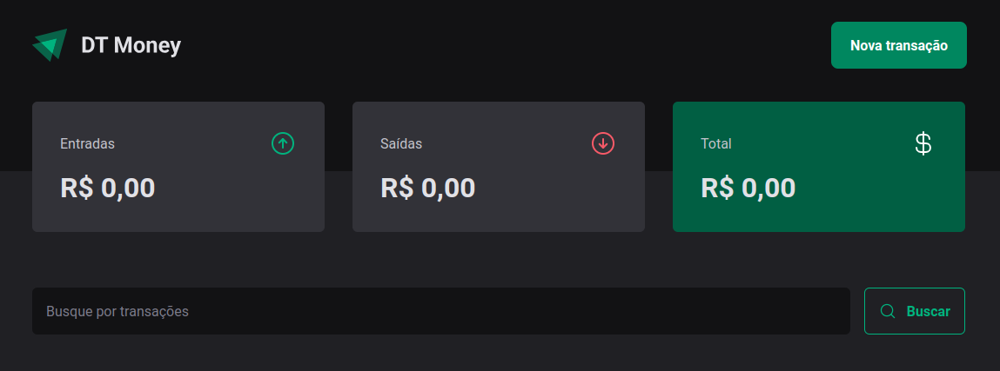

# ignite-react-money

React-based application designed to manage personal finances, built with TS/React as part of Rocketseat's Ignite bootcamp.

It allows users to track their income and expenses with ease.



## Features

- Add income and expense entries
- Categorize transactions
- View financial summaries

## Tech Stack

- React
- JavaScript
- HTML
- CSS
- Styled-components
- Axios
- React Hook Form
- Vite
- Zod

## Getting started

### Installation

1. Clone the repository:

```sh
git clone https://github.com/fpsaraiva/ignite-react-money.git
cd ignite-react-money
```

2. Install the dependencies:

```sh
npm install
```

### Usage

To start the development server, run:

```sh
npm run dev
```

This will start the app. The app will automatically reload if you make changes to the code.

## Contributing

Contributions are welcome! Please open an issue or submit a pull request if you have any improvements or bug fixes.
